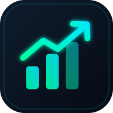

# Finanzas Personales

Tracker de finanzas personales (perfiles **Sergio** y **Comunes**): Resumen, Ingresos y Gastos, Registro, Categorías, Recurrentes y Resumen anual.

## Usarla
Abre **https://pietor12-spec.github.io/finanzas-personales/** en cualquier navegador (ordenador, móvil o tablet).

## Instalarla como app
- **Android / Chrome / Edge (ordenador):** botón **⬇ Instalar** en la cabecera, o menú ⋮ → *Instalar aplicación*.
- **iPhone / iPad (Safari):** botón Compartir → *Añadir a pantalla de inicio*.

Una vez abierta la primera vez, funciona también sin conexión.

## Tus datos
- Se guardan **solo en el navegador de cada dispositivo** (almacenamiento local). No se suben a ningún servidor ni a este repositorio.
- Para pasar datos de un dispositivo a otro: **💾 Backup → Descargar copia** en uno, y **Importar desde archivo** en el otro.
- Haz copias de vez en cuando: si borras los datos del navegador, se pierden los de ese dispositivo.

## Archivos
| Archivo | Qué es |
|---|---|
| `index.html` | La app completa |
| `manifest.webmanifest` | Nombre, colores e iconos de la app instalable |
| `sw.js` | Service worker: uso sin conexión y actualizaciones |
| `logo.svg` y `*.png` | Logo de marca e iconos |
